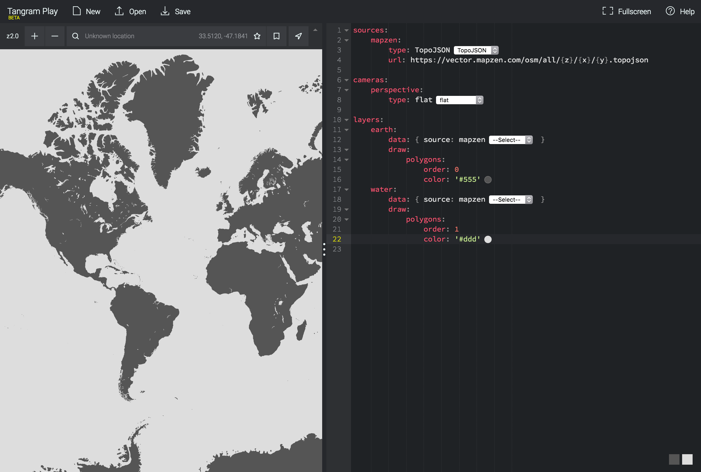
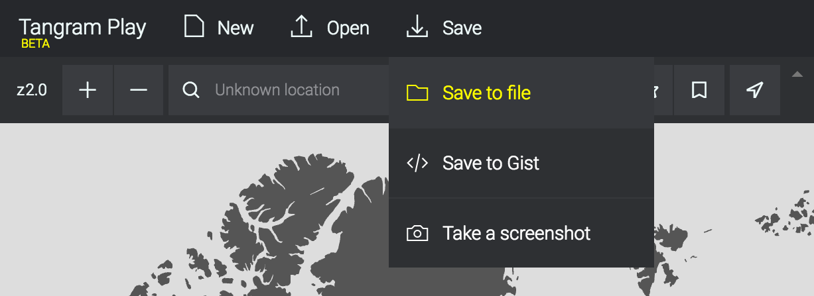
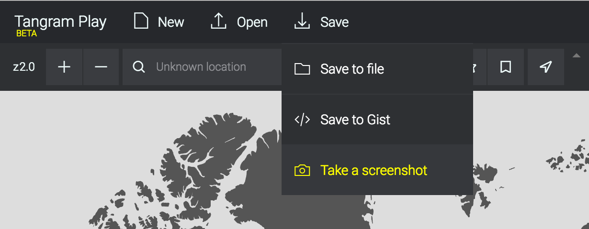
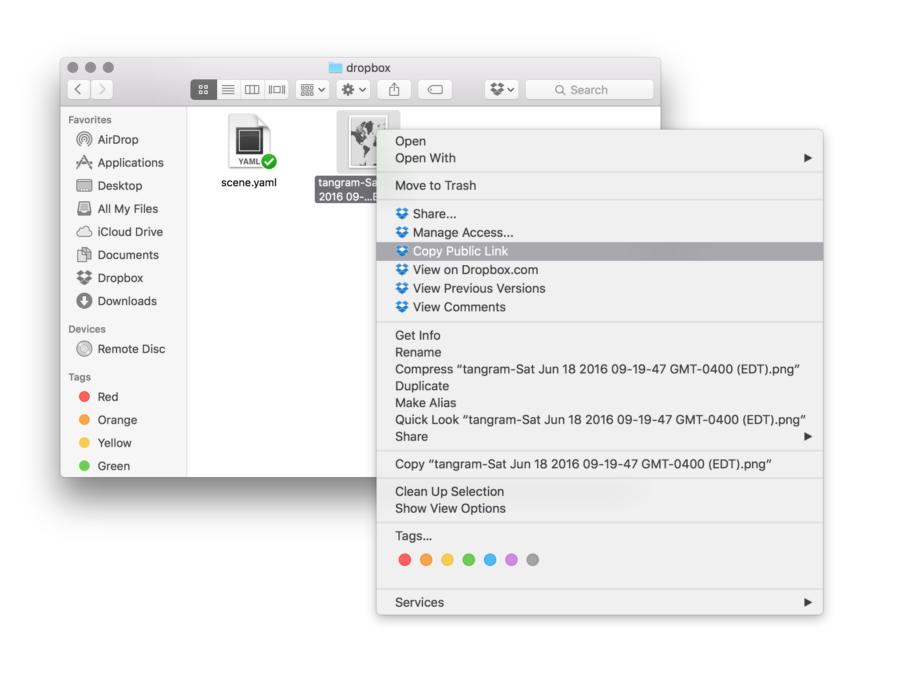
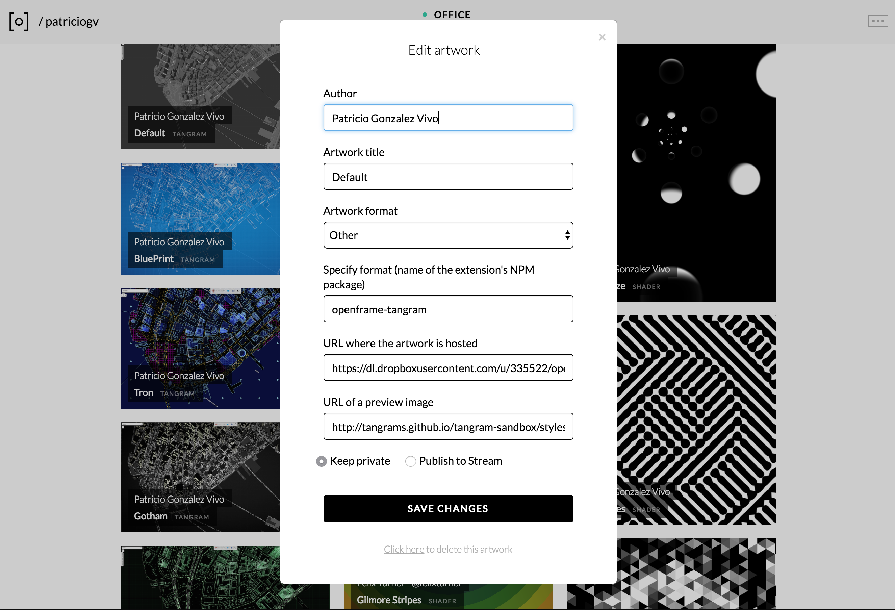
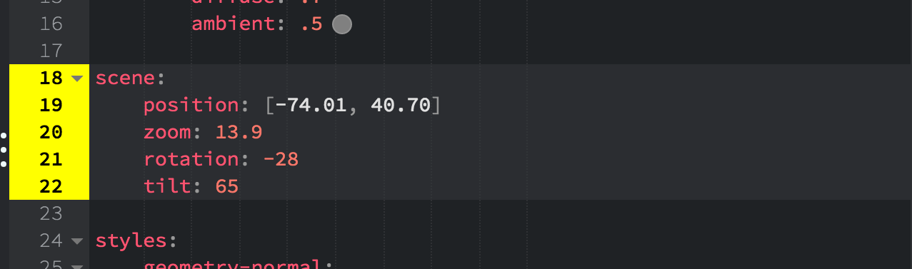

# Tangram extension for [Openframe](http://openframe.io/)

[Openframe](http://openframe.io/) is an open source platform for artists, curators and art enthusiasts to share, discover and display digital art.  Anyone can set up a frame using an HDMI display and a [Raspberry Pi](https://www.raspberrypi.org/).

This provides an extention for [Openframe](http://openframe.io/) to display maps via [Tangram ES](https://github.com/tangrams/tangram-es).

## How to install

Follow [this installation guide to install openframe](https://github.com/OpenframeProject/Openframe/wiki/Openframe-user-guide)

1. [Create an OpenFrame account](https://github.com/OpenframeProject/Openframe/wiki/Openframe-user-guide#1-create-a-user-account)
2. [Install Raspbian in a RaspberryPi](https://github.com/OpenframeProject/Openframe/wiki/Openframe-user-guide#20-initial-setup)
3. [Install OpenFrame on it](https://github.com/OpenframeProject/Openframe/wiki/Openframe-user-guide#21-install-openframe) using this script ```bash -c "$(curl http://openframe.io/install.sh)"```
4. [Setup your frame](https://github.com/OpenframeProject/Openframe/wiki/Openframe-user-guide#22-start-the-frame)

Once you have your frame working is time to install the extension for [Tangram ES](https://github.com/tangrams/tangram-es). For that in the console type:

```bash
openframe -i openframe-tangram 
```

Once the script finish you can push tangram maps to it.

## How add Tangram Maps as artworks

First you will need to create a Tangram Map scene file. For that you can use [**TangramPlay**](https://mapzen.com/tangram/play/). There you can code your Tangram scene file. 

 

**Note**: There are a lot of resources to learn about how to make Tangram ```.yaml``` scene files. The first place to start learning is [this tangram **documentation**](https://mapzen.com/documentation/tangram/). Once you are confortable with the structure of the scene files you can use and remix this [tangram **blocks**](http://tangrams.github.io/blocks/).

Once you have a map you are happy with is time to **save it to a file**.



And then take a screenshot of it 



[openFrame.io](http://openframe.io) doesn't store any file for you, so you need to host this two files on the cloud your self. A great way to start is by place in it in a **public dropbox folder** and get the **Public Link** to each of this files.



Once you have all in place is time to go to your [openFrame.io account](http://openframe.io), click on **"Add artwork"** and fill the form.

 

In the format section of the form choose **Other** and then specify the format as ```openframe-tangram```.

Then you need to provide the urls for the Tangram ```.yaml``` scene file and the screenshot of the map.

Publish it and share with others. Also let us know how it went! We are excited to see what have you done!

## Choosing a location, zoom, tilt and rotation for your map

[Tangram scene files](https://mapzen.com/documentation/tangram/Scene-file/) are designed to display maps in general, but as an artwork you probably want to pick a particular place and view. That's why I extend the official [Tangram scene file API](https://mapzen.com/documentation/tangram/Scene-file/) with a couple of variables inside the `scene` node to pick a: `position` (in longitud and latitud), `zoom` (zoom level), `rotation` (in degrees) and `tilt` (in degrees).




**Note**: This are not official values, so will not work any where else beside [openFrame.io](http://openframe.io) and my change in the future.
